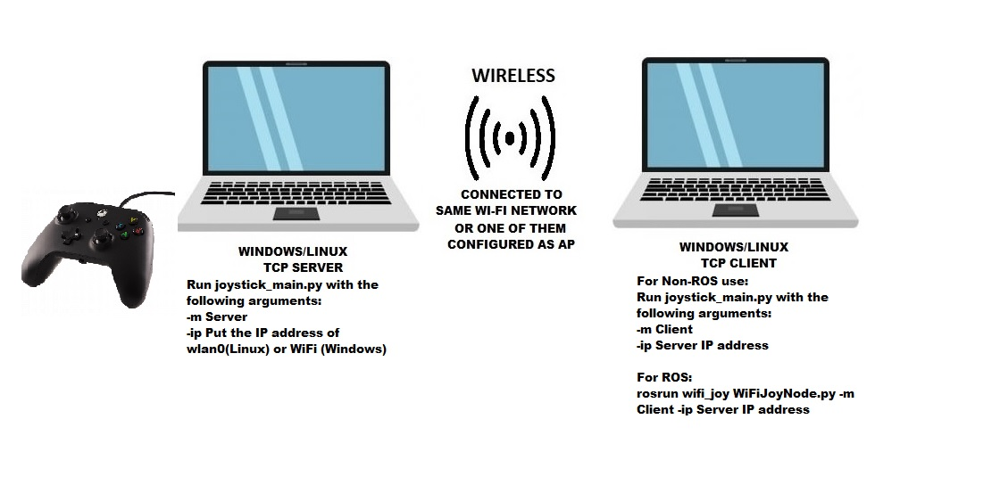

# Wireless Joystick Rover Control 
Wireless Rover Control over TCP socket using Joystick


### Usage 

- Start the server with joystick connected.
```
usage: joystick_main.py [-h] -m MODE -ip SERVER_IP [-p SERVER_PORT]   
optional arguments:                                                                                                                       
-h, --help            show this help message and exit                                                                                   
-m MODE, --mode MODE  MODE: Server or Client                                                                                            
-ip SERVER_IP, --server_ip SERVER_IP   SERVER_IP: e.g. 192.168.1.10                                                                                      
-p SERVER_PORT, --server_port SERVER_PORT  SERVER_PORT: e.g. 5050                                                                                            
```
- On the Client side, for **Non-ROS** usage, execute the **joystick_main.py** file with arguments -m Client -ip SERVER_IP 
- For **ROS**, execute **WiFiJoyNode.py** as follow:
   rosrun wifi_joy WiFiJoyNode.py -m Client -ip SERVER_IP

### Setting Up the Files: 

**ROS Version:** *Melodic*

**Requires Python 3**

**Setting up Python 3 on ROS:**
- sudo apt install python3-pip python3-yaml
- sudo pip3 install rospkg catkin_pkg
- sudo apt install python-catkin-tools python3-dev python3-numpy

**Setting up Wi-Fi Joystick package for ROS:**
On **command line**, execute the following:
- cd Desktop
- git clone **https://github.com/TejasAnilkumar12/Wireless-Joystick-Control-ROS**
- cd Wireless-Joystick-Control-ROS
- catkin_make
- echo "source /home/**username**/Desktop/Wireless-Joystick-Control-ROS/devel/setup.bash">> ~/.bashrc

**Note:** Edit out the username to match the username on your PC.

**External Libraries Required:**
protobuf, google, pygame

pygame prerequisites:

- sudo apt-get install python-dev libsdl-image1.2-dev libsdl-mixer1.2-dev libsdl-ttf2.0-dev libsdl1.2-dev libsmpeg-dev python-numpy subversion libportmidi-dev ffmpeg libswscale-dev libavformat-dev libavcodec-dev
- pip install protobuf google pygame
- pip3 install protobuf google pygame

**Note:** Check **ifconfig** on Linux or **ipconfig** on Windows for the Wi-Fi IP address. Use this IP address as the TCP SERVER_IP 
